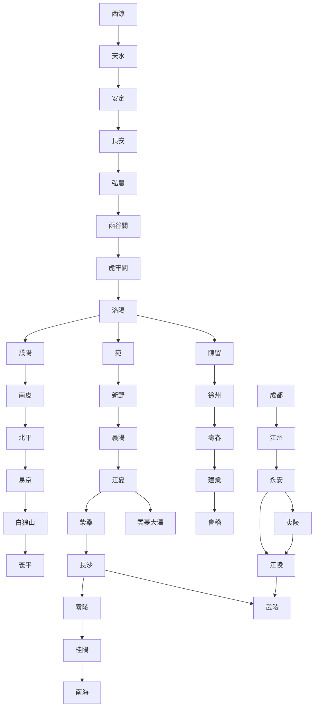
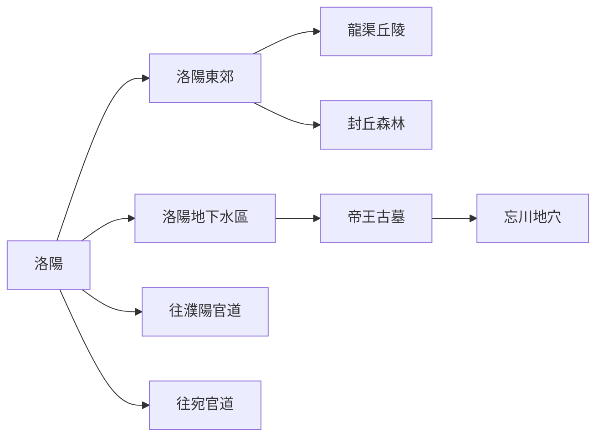
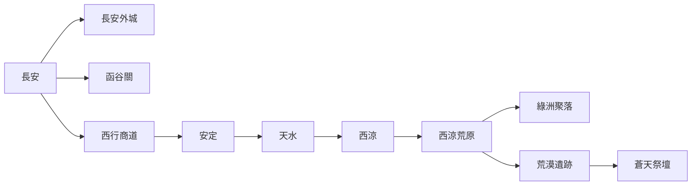
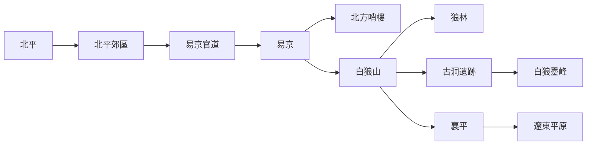
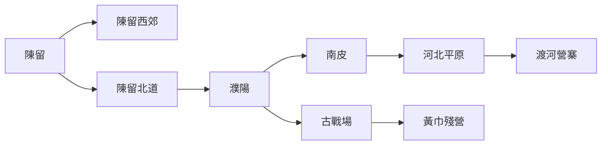
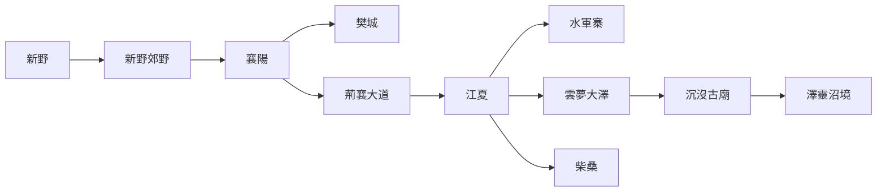
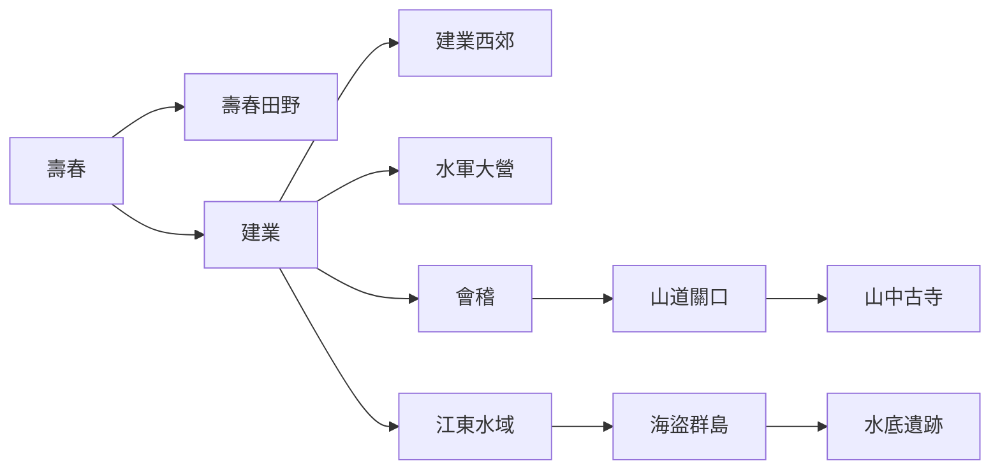
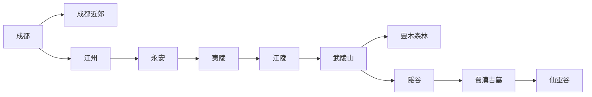
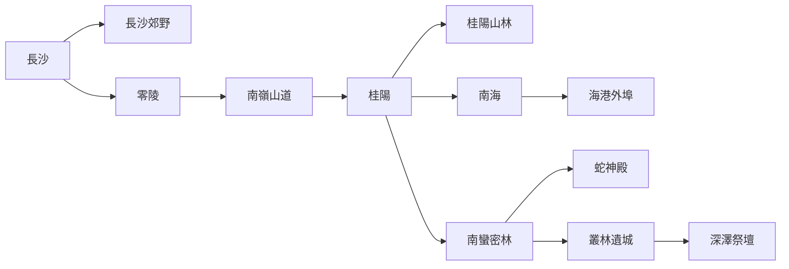
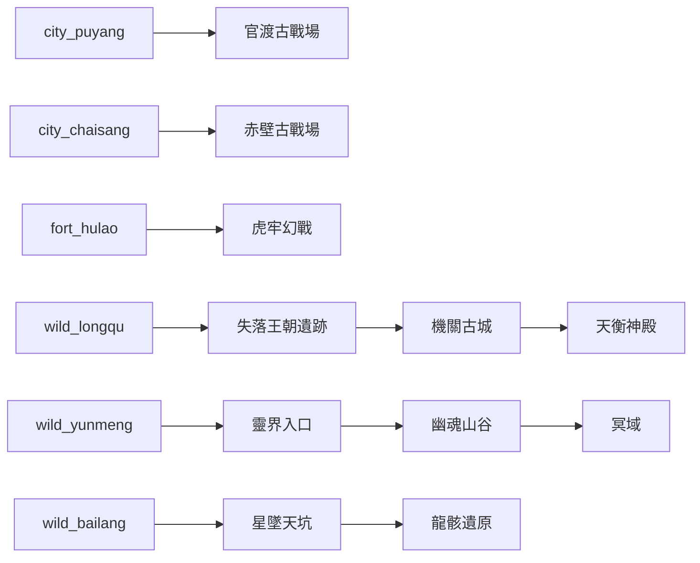

# 三國 MUD 世界完整連線圖（Graph 版）

此文件提供 **三國 MUD 世界完整連線圖（Graph 版）**，用來作為：

- `map.md` / `mapmd-json` 的世界拓樸參考
- `.roo` / generator 的上位世界圖
- AREA 之間的連線規劃藍圖
- choke point / branch / secret-zone 的結構依據

設計原則：

- 主幹線清楚
- 各州郡有支線與回環
- 城市、郊外、關隘、秘境分層
- 保留逐步擴寫到 120+ AREA 的空間

---

## 一、Graph 使用說明

節點命名規則：

- `city_*`：主城 / 城鎮
- `road_*`：官道 / 交通區
- `wild_*`：野外 / 山林 / 郊區
- `fort_*`：關隘 / 軍事據點
- `dng_*`：地下 / 洞窟 / 古墓
- `sec_*`：秘境 / 靈界 / 上古遺跡
- `hub_*`：世界級交通樞紐

連線類型建議：

- `-->`：主線單向理解可視為世界導向
- 實作時可依 AREA 改成雙向
- 關隘與秘境可做成條件解鎖、單向門、事件門

---

## 二、世界總覽 Graph



---

## 三、中原核心區 Graph



### 中原區節點說明

| 節點 | 類型 | 題材 |
|---|---|---|
| 洛陽 | 城市 hub | 歷史城市 |
| 洛陽東郊 | 城郊 | 江湖 / 新手野外 |
| 龍渠丘陵 | 野外 | 探險遺跡 |
| 封丘森林 | 野外 | 詭異民俗 |
| 洛陽地下水區 | 地下 | 仙俠 / 詭異 |
| 帝王古墓 | 深層地下 | 探險 / 仙俠 |

---

## 四、關中與西域 Graph



---

## 五、北方幽州 Graph



---

## 六、兗州與河北 Graph



---

## 七、荊州 Graph



---

## 八、江東 Graph



---

## 九、蜀漢 Graph



---

## 十、南方與南蠻 Graph



---

## 十一、世界級秘境與事件 Graph



---

## 十二、120+ AREA 擴充用分層規則

你之後若要從目前世界圖擴到 **120+ AREA**，建議每個主節點都拆成 3～6 個子節點：

### 城市節點拆法

- 外城門
- 主街
- 市集
- 官府 / 軍營 / 銀行
- 居民區
- 特殊入口（下水道 / 皇宮 / 驛站）

### 郊外節點拆法

- 官道
- 岔路口
- 農田 / 林地
- 廢屋 / 破廟
- 特殊怪區
- 秘密支線入口

### 關隘節點拆法

- 關前道
- 外寨
- 關門
- 關樓
- 軍械所
- 後山密道

### 地下 / 秘境節點拆法

- 入口前廳
- 主廊道
- 支路房
- 機關 / 封印房
- 核心區
- 隱藏房 / Boss 房

---

## 十三、推薦 Graph 對接格式

在 `map.md` / `mapmd-json` 中可對應成：

```md
Theme: 軍旅
Subtheme: 關隘守備
LevelRange: 25-35

Connections:
west: city_hongnong
east: fort_hulao
north: fort_watchtower
south: wild_supply_route
down: dng_secret_tunnel
```

Graph node metadata 建議：

```json
{
  "id": "fort_hulao",
  "label": "虎牢關",
  "type": "fort",
  "theme": "軍旅",
  "subtheme": "關隘 / 戰場",
  "levelRange": "30-40",
  "worldLinks": ["city_hongnong", "city_loyang", "sec_hulao_war"]
}
```

---

## 十四、優先實作順序

### Phase 1：新手可玩主線

- 洛陽
- 洛陽東郊
- 龍渠丘陵
- 洛陽地下水區

### Phase 2：北方支線

- 北平
- 北平郊區
- 易京
- 白狼山

### Phase 3：荊州支線

- 新野
- 襄陽
- 江夏
- 雲夢大澤

### Phase 4：關中西域

- 長安
- 函谷關
- 西涼荒原

### Phase 5：蜀漢與江東

- 建業
- 會稽
- 成都
- 武陵山

### Phase 6：世界級秘境

- 帝王古墓
- 黃巾殘營
- 赤壁古戰場
- 靈界入口
- 天衡神殿

---

## 十五、總結

這份 Graph 版世界圖可以當成你的 **上位世界 schema**：

- 橫向：州郡主線交通
- 縱向：城市 → 郊外 → 關隘 / 地下 / 秘境
- 深度：支線、隱藏區、世界事件區

如果你下一步要進入真正可生成的規格化階段，最適合接著做的是：

1. `world-graph.json`
2. 各大州郡 `map.md`
3. 節點等級分佈表
4. world connector / choke point 規格表
