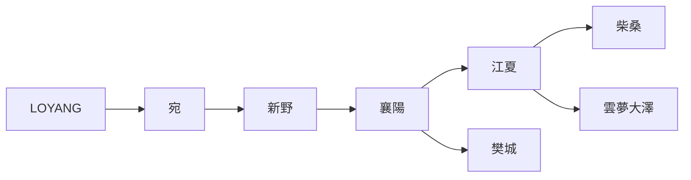
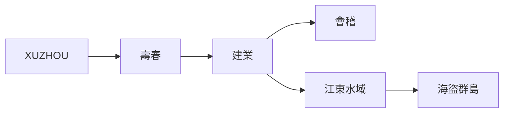
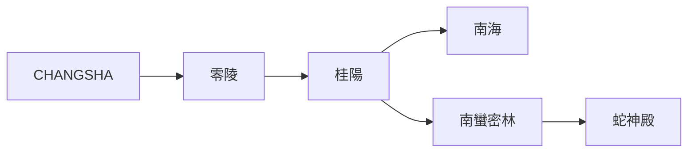
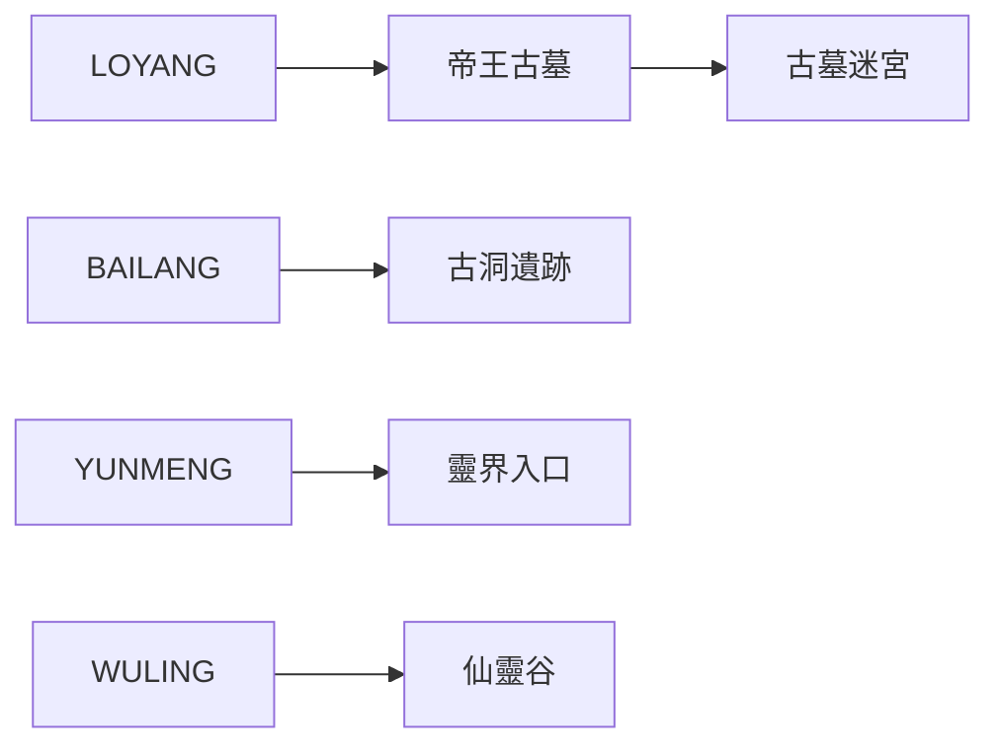

# 三國 MUD 世界完整拓撲圖

此文件提供 **三國 MUD 世界區域拓撲圖 (Topology Map)**。  
用途：

- 作為 `map.md` 規劃依據
- 規劃 AREA 連接
- 協助 generator / roo scaffold
- 確保世界探索路線合理

以下使用 **Mermaid graph** 描述世界拓撲。

---

# 世界主幹拓撲


---

# 北方幽州拓撲


---

# 荊州拓撲


---

# 江東拓撲


---

# 蜀漢拓撲


---

# 南方拓撲


---

# 秘境與世界事件拓撲


---

# 世界交通節點 (Choke Points)

| 節點 | 作用 |
|----|----|
虎牢關 | 中原東西門戶 |
函谷關 | 關中入口 |
易京 | 北方戰略要地 |
白狼山 | 遼東邊境 |
夷陵 | 蜀漢與荊州咽喉 |

---

# 世界區域統計

| 類型 | 數量 |
|---|---|
城市 | 14 |
城郊 | 12 |
軍事 | 10 |
江湖 | 10 |
探險 | 12 |
仙俠 | 8 |
詭異 | 6 |

總區域 ≈ **70–90 AREA**

---

# 建議 map.md 連線形式

```
Connections:

west: changan
east: loyang
north: puyang
south: xinye
down: ancient_tomb
enter: city_gate
```
