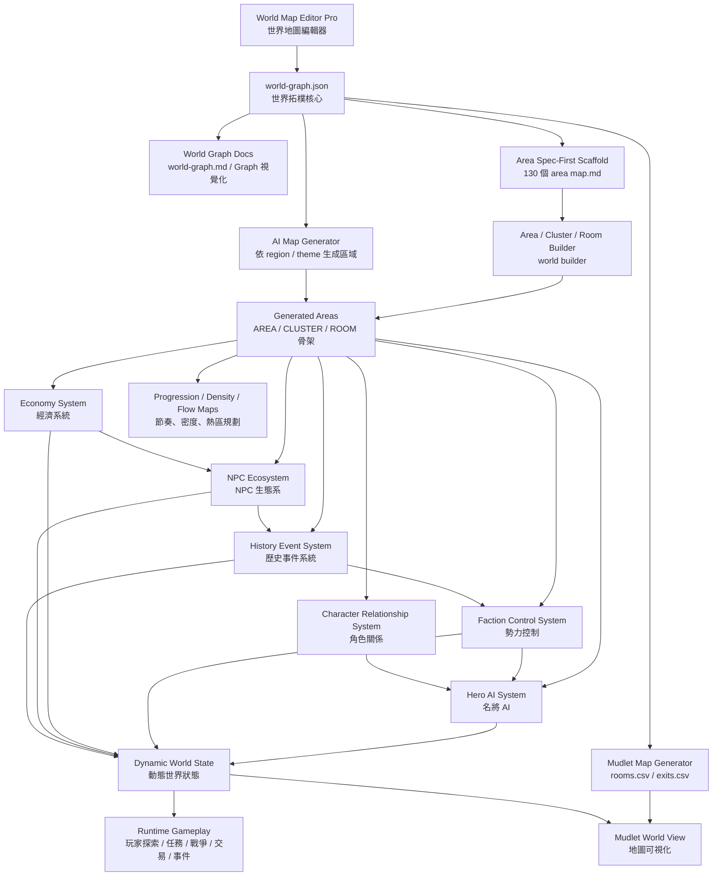

# 三國 MUD 世界設計總藍圖（Architecture Map）

這份文件把目前已建立的三國 MUD 世界系統整理成一張完整架構圖，方便你用於：

- 世界觀與系統設計總覽
- GitHub README / Writerside 文件
- 專案規劃與模組拆分
- 後續 generator / editor / runtime 串接

---

## 一、總體架構圖



---

## 二、分層說明

### 1. 編輯與設計層

這一層是世界的「輸入端」，負責定義世界長什麼樣。

包含：

- World Map Editor Pro
- 世界可視化地圖
- Architecture Map
- Progression Map
- Room Density Map
- Player Flow Map
- Area Cluster Map

用途：

- 規劃世界骨架
- 控制節奏與密度
- 調整區域關係與探索順序

---

### 2. 世界拓樸核心層

這一層的核心就是：

```text
world-graph.json
```

它負責描述：

- 世界有哪些節點
- 節點彼此怎麼連
- 每個節點屬於哪個 region
- 每個節點的 type / theme / levelRange

這份檔案是整個世界生成系統的 source of truth。

---

### 3. 區域生成層

從 `world-graph.json` 往下展開：

```text
world-graph.json
    ↓
AREA
    ↓
CLUSTER
    ↓
ROOM
```

包含：

- spec-first AREA scaffold
- world builder
- AI map generator

用途：

- 快速建立大世界骨架
- 批量生成區域
- 讓每個 AREA 可再細化為 cluster / room

---

### 4. 世界模擬層

這一層負責讓世界「不是靜態的」。

包含：

- NPC Ecosystem
- Economy System
- History Event System
- Faction Control System
- Character Relationship System
- Hero AI System

用途：

- 讓 NPC 會移動、巡邏、交易、戰鬥
- 讓勢力會攻城與改變地圖控制權
- 讓歷史事件影響世界狀態
- 讓名將與人物關係真正改變戰局

---

### 5. Runtime 層

最終會進到遊戲執行層：

- 玩家探索
- 任務
- 戰場
- 商店與交易
- 攻城與勢力變動
- 世界事件與動態 NPC

這一層可以視為：

```text
Dynamic World State
    ↓
Runtime Gameplay
```

---

## 三、目前已有的模組

### 世界與地圖

- world-graph.json
- world-graph.md
- 三國 MUD 世界完整連線圖（Graph 版）
- 三國 MUD 世界 130 AREA 可視化世界地圖
- MUD World Map Editor
- MUD World Map Editor Pro
- Mudlet Map Generator

### 區域生成

- 130 AREA scaffold
- spec-first AREA scaffold
- 高品質 AREA templates
- World Builder
- AI Map Generator

### 世界平衡規劃

- AREA 類型分布圖
- Progression Map
- Area Cluster Map
- Room Density Map
- Player Flow Map

### 動態世界系統

- 歷史事件系統
- 勢力控制系統
- AI 勢力戰略系統
- NPC 生態系統
- 經濟系統
- 角色關係系統
- 名將 AI 系統

---

## 四、推薦的專案目錄結構

```text
project/
├─ world/
│  ├─ world-graph.json
│  ├─ world-graph.md
│  ├─ progression-map.md
│  ├─ room-density-map.md
│  ├─ player-flow-map.md
│  └─ architecture-map.md
│
├─ tools/
│  ├─ world-map-editor/
│  ├─ world-map-editor-pro/
│  ├─ mudlet-map-generator/
│  ├─ world-builder/
│  └─ ai-map-generator/
│
├─ systems/
│  ├─ history-events/
│  ├─ faction-control/
│  ├─ ai-strategy/
│  ├─ npc-ecosystem/
│  ├─ economy/
│  ├─ character-relationships/
│  └─ hero-ai/
│
├─ area/
│  ├─ city_loyang/
│  ├─ wild_loyang_east/
│  ├─ fort_hulao/
│  └─ ...
│
└─ docs/
   ├─ world-layout-map.md
   ├─ area-cluster-map.md
   └─ architecture/
```

---

## 五、推薦開發順序

### Phase 1：世界骨架完成
- world-graph.json
- 世界地圖可視化
- Progression / Density / Flow 規劃

### Phase 2：首批可玩區域
- 洛陽
- 洛陽東郊
- 龍渠丘陵
- 洛陽地下水區

### Phase 3：基礎動態系統
- NPC 生態
- 歷史事件
- 勢力控制

### Phase 4：高階動態世界
- AI 勢力戰略
- 經濟系統
- 名將 AI
- 角色關係

### Phase 5：整合 Runtime
- 任務與商店
- 攻城戰
- 世界事件
- Mudlet 地圖整合
- 自動生成工具串接

---

## 六、最重要的核心觀念

你現在的三國 MUD 不只是地圖，而是一套：

```text
世界拓樸
→ 區域生成
→ 動態模擬
→ 玩家互動
```

也就是：

```text
World Design Engine
```

這代表你已經不是在單純做 AREA，而是在做一個可持續擴充的三國沙盒世界框架。

---

## 七、後續最值得做的兩件事

### 1. 把所有工具與系統統一成同一份 config / schema
例如：

- world-graph.json
- factions.json
- events.json
- economy.json

讓工具之間能互相讀取。

### 2. 選一條垂直切片做到底
推薦：

```text
洛陽
→ 洛陽東郊
→ 龍渠丘陵
→ 洛陽地下水
```

把它做成：

- 可走
- 可打
- 有任務
- 有事件
- 有 NPC 生態
- 有商店

這樣你就會從「完整設計」進入「真正可玩」。

